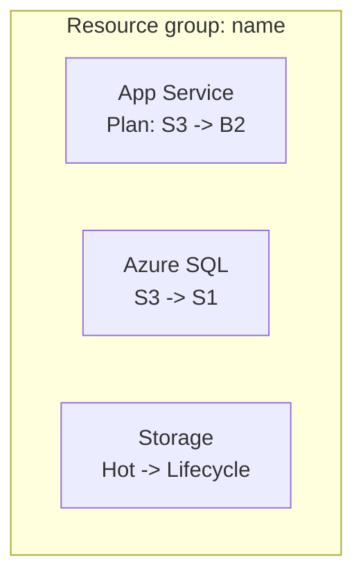

# Azure cost optimization

Analyze infrastructure-as-code files and deployed Azure resources to generate cost optimization recommendations. Then create an individual GitHub work item (`issue`) for each opportunity and a coordinating epic.

> [!NOTE]
> This skill depends on the `Azure MCP Server/*` and `github/*` toolsets. This kit's IaC uses **Terraform**, so `.tf` files are the intended configuration source. If either required toolset is unavailable, report the affected phase as blocked. Do not substitute unobserved CLI output or claim that work items were created.

## When to Invoke

- "Reduce our Azure spending for the SIFAP workload."
- "Right-size these oversized resources and track the work."
- "Open GitHub work items for our Azure cost optimization opportunities."
- "Where are we wasting money in this resource group?"

## Prerequisites

- Azure MCP Server configured and authenticated. In a cloud coding agent, use the supported `azd coding-agent config` workflow.
- GitHub tools configured and authenticated.
- Target GitHub repository identified.
- Azure resources deployed (IaC files are optional but helpful).

## Workflow steps

### Step 1: Get Azure best practices

Run `azmcp-bestpractices-get` to load current Azure optimization guidance. Use it to ground the analysis and recommendations. Cite the relevant best practice in each recommendation.

### Step 2: Discover Azure infrastructure

1. **Resource discovery**:
    - Use `azmcp-subscription-list` to find subscriptions.
    - Use `azmcp-group-list --subscription <id>` to find resource groups.
    - Use Azure MCP resource discovery for a complete inventory and service-specific details.
    - When an Azure MCP capability is unavailable, record that resource as not assessed; do not replace evidence with assumptions.
2. **IaC detection**:
    - Look for Terraform files under `infra/**/*.tf`.
    - Analyze resource definitions and compare them with discovered resources.
    - Use only IaC files as the source of truth, not other repository files.
    - If no Terraform files are found, stop and inform the user; this kit does not authorize direct configuration drift.
3. **Configuration analysis**: extract current SKUs, tiers, and settings; map dependencies and utilization patterns.

### Step 3: Collect usage metrics and validate current costs

1. **Find monitoring sources**: use `azmcp-monitor-workspace-list`, then `azmcp-monitor-table-list` to discover tables.
2. **Run usage queries** with `azmcp-monitor-log-query` (`recent` and `errors` presets) or custom KQL:

```kql
AppServiceAppLogs
| where TimeGenerated > ago(7d)
| summarize avg(CpuTime) by Resource, bin(TimeGenerated, 1h)
```

```kql
AzureDiagnostics
| where ResourceProvider == "MICROSOFT.DOCUMENTDB"
| where TimeGenerated > ago(7d)
| summarize avg(RequestCharge) by Resource
```

3. **Calculate baseline metrics**: CPU/memory averages, database throughput, storage access frequency, and function execution rates.
4. **Validate current costs**: using discovered SKUs and measured usage, look up current Azure pricing and record the source URL, retrieval date, region, currency, billing unit, assumptions, and calculation. Never present a list price as an invoice total.

### Step 4: Generate cost optimization recommendations

1. **Apply optimization patterns**:

| Area | Pattern |
|---|---|
| Compute | Right-size App Service plans; move low-usage Functions from Premium to Consumption; downsize oversized VMs |
| Databases | Move provisioned Cosmos DB to serverless for variable workloads; right-size RU/s; right-size SQL DTU tiers |
| Storage | Apply lifecycle policies (Hot to Cool, then Archive); consolidate redundant accounts; right-size tiers |
| Infrastructure | Remove unused resources; add autoscaling; schedule shutdowns for non-production environments |

2. **Calculate evidence-based savings**: subtract the target estimate from the current estimate using the same currency, region, billing assumptions, and observation window. Document both sources and calculations.
3. **Rank without invented scoring**: present validated savings, utilization evidence, implementation dependencies, rollback path, and qualitative risk side by side. Let the accountable team assign priority unless it has supplied a scoring model.
4. **Validate recommendations**: confirm the Terraform change surface, savings calculation, risks, prerequisites, validation plan, and rollback. All claims need evidence or an explicit assumption.

### Step 5: Get user confirmation

Present the summary and gate work item creation on explicit approval:

```text
Azure cost optimization summary

Analysis results:
- Total resources analyzed: X
- Current monthly cost: $X
- Potential monthly savings: $Y
- Optimization opportunities: Z
- High-priority items: N

Recommendations:
1. [Resource]: [Current SKU] -> [Target SKU] = $X/month - [Risk] | [Effort]
2. [Resource]: [Current] -> [Target] = $Y/month - [Risk] | [Effort]

This will create Z individual GitHub work items and one epic.

Proceed with creating GitHub work items? (y/n)
```

> [!IMPORTANT]
> Create GitHub work items only after an explicit affirmative response. If the response is negative, ambiguous, or absent, print the recommendations to the console and stop.

### Step 6: Create individual optimization work items

After approval, call the GitHub identity tool, search open issues for duplicates, and list issue types for an organization repository. Create one work item per opportunity using the individual template in [Output Template](#output-template). Add labels only when they already exist. Title format: `[COST-OPT] [Resource type] - [Brief description] - <validated currency amount>/month potential savings`.

### Step 7: Create the coordinating epic

Create the coordinating epic only after all individual creation results are known. Include returned issue URLs and partial failures. Use an existing epic issue type or label; do not invent one. Validate any Mermaid diagram before including it. Title format: `[EPIC] Azure cost optimization initiative - <validated currency amount>/month potential savings`.

## Error handling

| Situation | Action |
|---|---|
| Savings estimates without evidence | Recheck settings and pricing sources before proceeding |
| Azure authentication or tool failure | Report the blocked phase and the missing prerequisite; do not infer live state |
| No resources found | Report the observed empty scope and stop without creating speculative work |
| GitHub creation failure | Record which creations succeeded or failed and return the approved issue bodies |
| Insufficient usage data | Record the limitation and provide only configuration-based recommendations |

## Output Template

Individual optimization work item:

````markdown
## Cost optimization: <Brief title>

**Potential monthly savings**: <amount and currency> | **Risk level**: <evidence-backed rating> | **Effort**: <team estimate or not estimated>

### Description
<Clear explanation of the optimization and why it is needed>

### Implementation

Terraform source: `<path>`

Apply the reviewed change in Terraform in a later implementation task. During this workflow, inspect the proposed plan without applying it:

```bash
terraform -chdir=<module> fmt -check
terraform -chdir=<module> init -backend=false -input=false
terraform -chdir=<module> validate
terraform -chdir=<module> plan -input=false
```

### Evidence
- Current configuration: <details>
- Usage pattern: <monitoring data evidence>
- Cost impact: <current amount and currency> -> <target amount and currency>
- Pricing evidence: <official URL, retrieval date, region, units, assumptions>
- Utilization evidence: <query/source, time window, result, freshness limit>
- Best practice alignment: <official reference>

### Validation steps
- [ ] Test in a non-production environment
- [ ] Verify no performance degradation
- [ ] Confirm cost reduction in Azure Cost Management
- [ ] Update monitoring and alerts if needed

### Risks and considerations
- <Risk and mitigation>

**Priority**: <team decision or pending> | **Decision owner**: <role>
````

Coordinating epic:

````markdown
## Azure cost optimization epic

**Total potential savings**: <amount and currency>/month | **Timeline**: <team estimate or not estimated>

### Executive summary
- Resources analyzed: X
- Optimization opportunities: Y
- Total potential monthly savings: $X
- High-priority items: N

### Current architecture overview



### Implementation tracking

Team-prioritized:
- [ ] #<issue>: <Title> - $X/month savings

Priority pending:
- [ ] #<issue>: <Title> - $X/month savings

### Progress tracking
- Completed: 0 of Y optimizations
- Savings achieved: $0 of $X/month

### Success criteria
- [ ] All high-priority optimizations implemented
- [ ] Realized savings are measured against the documented baseline and reported without changing the original estimate
- [ ] No performance degradation observed
- [ ] Cost monitoring dashboard updated
````

## Quality Gate

- [ ] Each cost estimate was checked against actual resource configuration and Azure pricing.
- [ ] Recommendations derive from Terraform and observed Azure state, or the workflow stops when either source is unavailable.
- [ ] Each estimate records official pricing evidence, date, region, currency, units, assumptions, and telemetry window.
- [ ] Each recommendation includes risk, dependencies, a Terraform change surface, validation, and rollback without an invented score or timeline.
- [ ] One traceable GitHub work item was created per opportunity, plus a coordinating epic.
- [ ] Work items were created only after explicit user confirmation.
- [ ] Duplicate searches, issue types, returned URLs, and partial failures were recorded from GitHub tool output.
- [ ] Each architecture diagram is valid Mermaid and accurately represents the current state.
- [ ] No Azure mutation or `terraform apply` occurred during analysis.
