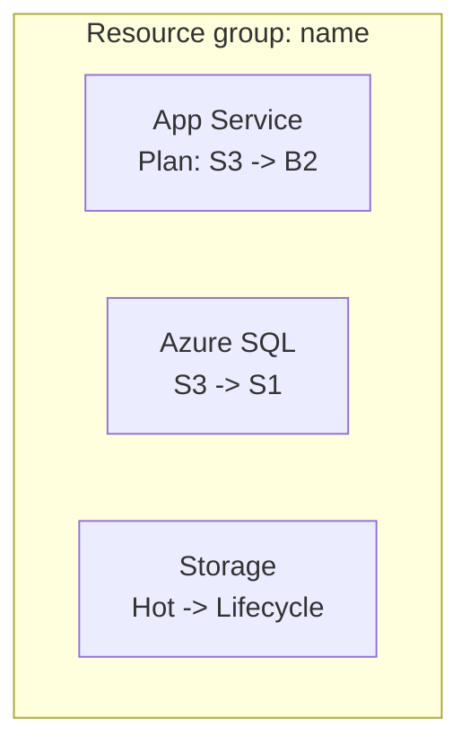

# Azure cost optimization

Analyze infrastructure-as-code files and deployed Azure resources to generate cost optimization recommendations. Then create an individual GitHub work item (`issue`) for each opportunity and a coordinating epic.

> [!NOTE]
> This skill depends on authentication with the **Azure MCP server** and the **GitHub MCP server** (or `gh`). This kit's IaC uses **Terraform**, so `.tf` files are the primary source of truth. Treat other repository files as non-authoritative. When available, prefer Azure MCP tools (`azmcp-*`) over direct Azure CLI commands.

## When to Invoke

- "Reduce our Azure spending for the SIFAP workload."
- "Right-size these oversized resources and track the work."
- "Open GitHub work items for our Azure cost optimization opportunities."
- "Where are we wasting money in this resource group?"

## Prerequisites

- Azure MCP server configured and authenticated.
- GitHub MCP server (or `gh`) configured and authenticated.
- Target GitHub repository identified.
- Azure resources deployed (IaC files are optional but helpful).

## Workflow steps

### Step 1: Get Azure best practices

Run `azmcp-bestpractices-get` to load current Azure optimization guidance. Use it to ground the analysis and recommendations. Cite the relevant best practice in each recommendation.

### Step 2: Discover Azure infrastructure

1. **Resource discovery**:
    - Use `azmcp-subscription-list` to find subscriptions.
    - Use `azmcp-group-list --subscription <id>` to find resource groups.
    - Use `az resource list --subscription <id> --resource-group <name>` for a complete inventory.
    - Prefer resource-specific MCP tools, with the CLI as a fallback: `azmcp-cosmos-account-list`, `azmcp-storage-account-list`, `azmcp-monitor-workspace-list`, `azmcp-keyvault-key-list`; and `az webapp list`, `az appservice plan list`, `az functionapp list`, `az sql server list`, `az redis list` when no MCP tool exists.
2. **IaC detection**:
    - Look for IaC files: `**/*.tf` (primary in this kit), plus `**/*.bicep`, `**/main.json`, and `**/*template*.json`.
    - Analyze resource definitions and compare them with discovered resources.
    - Use only IaC files as the source of truth, not other repository files.
    - If no IaC files are found, stop and inform the user.
3. **Configuration analysis**: extract current SKUs, tiers, and settings; map dependencies and utilization patterns.

### Step 3: Collect usage metrics and validate current costs

1. **Find monitoring sources**: use `azmcp-monitor-workspace-list`, then `azmcp-monitor-table-list` to discover tables.
2. **Run usage queries** with `azmcp-monitor-log-query` (`recent` and `errors` presets) or custom KQL:

```kql
AppServiceAppLogs
| where TimeGenerated > ago(7d)
| summarize avg(CpuTime) by Resource, bin(TimeGenerated, 1h)
```

```kql
AzureDiagnostics
| where ResourceProvider == "MICROSOFT.DOCUMENTDB"
| where TimeGenerated > ago(7d)
| summarize avg(RequestCharge) by Resource
```

3. **Calculate baseline metrics**: CPU/memory averages, database throughput, storage access frequency, and function execution rates.
4. **Validate current costs**: using the discovered SKUs/tiers, look up current Azure pricing (or use the `azure-pricing` skill) and document Resource -> Current SKU -> Estimated monthly cost before recommending changes.

### Step 4: Generate cost optimization recommendations

1. **Apply optimization patterns**:

| Area | Pattern |
|---|---|
| Compute | Right-size App Service plans; move low-usage Functions from Premium to Consumption; downsize oversized VMs |
| Databases | Move provisioned Cosmos DB to serverless for variable workloads; right-size RU/s; right-size SQL DTU tiers |
| Storage | Apply lifecycle policies (Hot to Cool, then Archive); consolidate redundant accounts; right-size tiers |
| Infrastructure | Remove unused resources; add autoscaling; schedule shutdowns for non-production environments |

2. **Calculate evidence-based savings**: subtract the target cost from the validated current cost and document the pricing source for both.
3. **Calculate a priority score** for each recommendation:

```text
Priority score = (Value score x Monthly savings) / (Risk score x Implementation days)

High priority:   Score > 20
Medium priority: Score 5-20
Low priority:    Score < 5
```

4. **Validate recommendations**: check CLI commands, confirm savings calculations, and assess risks and prerequisites. All savings must have supporting evidence.

### Step 5: Get user confirmation

Present the summary and gate work item creation on explicit approval:

```text
Azure cost optimization summary

Analysis results:
- Total resources analyzed: X
- Current monthly cost: $X
- Potential monthly savings: $Y
- Optimization opportunities: Z
- High-priority items: N

Recommendations:
1. [Resource]: [Current SKU] -> [Target SKU] = $X/month - [Risk] | [Effort]
2. [Resource]: [Current] -> [Target] = $Y/month - [Risk] | [Effort]

This will create Z individual GitHub work items and one epic.

Proceed with creating GitHub work items? (y/n)
```

> [!IMPORTANT]
> Create GitHub work items only after an explicit affirmative response. If the response is negative, ambiguous, or absent, print the recommendations to the console and stop.

### Step 6: Create individual optimization work items

Create one GitHub work item per opportunity with the `cost-optimization` and `azure` labels, using the individual item template in [Output Template](#output-template). Title format: `[COST-OPT] [Resource type] - [Brief description] - $X/month savings`.

### Step 7: Create the coordinating epic

Create an epic with the `cost-optimization`, `azure`, and `epic` labels, using the epic template in [Output Template](#output-template). Check that each Mermaid diagram has valid syntax and is accessible (styling and colors). Title format: `[EPIC] Azure cost optimization initiative - $X/month potential savings`.

## Error handling

| Situation | Action |
|---|---|
| Savings estimates without evidence | Recheck settings and pricing sources before proceeding |
| Azure authentication failure | Provide manual Azure CLI setup steps |
| No resources found | Create an informational work item about deploying resources |
| GitHub creation failure | Display formatted recommendations in the console |
| Insufficient usage data | Record the limitation and provide only configuration-based recommendations |

## Output Template

Individual optimization work item:

````markdown
## Cost optimization: <Brief title>

**Monthly savings**: $X | **Risk level**: <Low/Medium/High> | **Implementation effort**: X days

### Description
<Clear explanation of the optimization and why it is needed>

### Implementation

IaC files detected: <Yes/No>

When IaC files are found, apply the change in Terraform (for example, in `infra/app_service.tf`, change `sku_name = "S3"` to `sku_name = "B2"`):

```bash
terraform -chdir=infra apply
```

When no IaC files are found, use the Azure CLI directly and warn that an authoritative IaC file may exist elsewhere:

```bash
az appservice plan update --name <plan> --sku B2
```

### Evidence
- Current configuration: <details>
- Usage pattern: <monitoring data evidence>
- Cost impact: $X/month -> $Y/month
- Best practice alignment: <reference>

### Validation steps
- [ ] Test in a non-production environment
- [ ] Verify no performance degradation
- [ ] Confirm cost reduction in Azure Cost Management
- [ ] Update monitoring and alerts if needed

### Risks and considerations
- <Risk and mitigation>

**Priority score**: X | **Value**: X/10 | **Risk**: X/10
````

Coordinating epic:

````markdown
## Azure cost optimization epic

**Total potential savings**: $X/month | **Implementation timeline**: X weeks

### Executive summary
- Resources analyzed: X
- Optimization opportunities: Y
- Total potential monthly savings: $X
- High-priority items: N

### Current architecture overview



### Implementation tracking

High priority (implement first):
- [ ] #<issue>: <Title> - $X/month savings

Medium priority:
- [ ] #<issue>: <Title> - $X/month savings

Low priority:
- [ ] #<issue>: <Title> - $X/month savings

### Progress tracking
- Completed: 0 of Y optimizations
- Savings achieved: $0 of $X/month

### Success criteria
- [ ] All high-priority optimizations implemented
- [ ] More than 80% of estimated savings achieved
- [ ] No performance degradation observed
- [ ] Cost monitoring dashboard updated
````

## Quality Gate

- [ ] Each cost estimate was checked against actual resource configuration and Azure pricing.
- [ ] Recommendations derive only from authoritative IaC files, or execution stops when none are found.
- [ ] Each recommendation includes evidence, a priority score, and specific executable commands.
- [ ] One traceable GitHub work item was created per opportunity, plus a coordinating epic.
- [ ] Work items were created only after explicit user confirmation.
- [ ] Each architecture diagram is valid Mermaid and accurately represents the current state.
