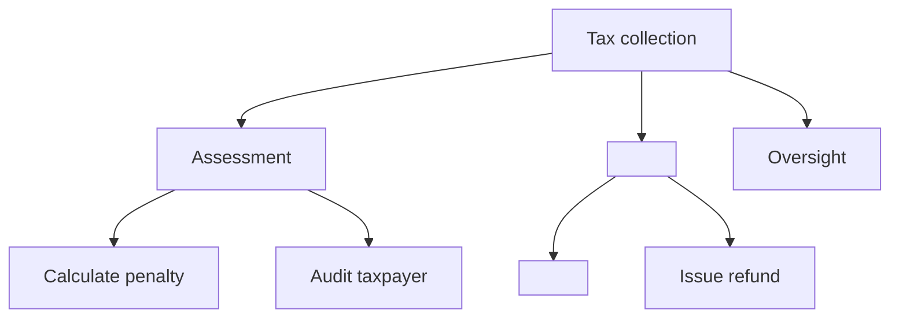

# Capability map

## When to Invoke

- "Create a capability map for the domain identified by the team."
- "Where does ownership overlap between two teams?"
- "Which capabilities are core and which are commodity?"

## Concept

A **capability** describes *what* the enterprise does, not *how* it does it. Capabilities remain stable for decades, while applications and processes change frequently.

## Structure (3 levels)

- **L1**: top-level business area (for example, "Tax collection" or "Customer service").
- **L2**: major subfunctions identified by the team.
- **L3**: specific capabilities confirmed by evidence.

Rule of thumb: 8 to 12 L1 capabilities for a medium-sized enterprise.

## Steps

1. **Start with outcomes**, not the organization chart. "What does this enterprise do for its customers?"
2. **Decompose top-down** to L3. Stop when a capability maps to a single owner.
3. **Classify each capability**:

- **Core**: differentiating; build in-house.
- **Supporting**: necessary; buy or configure.
- **Commodity**: undifferentiated; outsource or use software as a service (SaaS).

4. **Overlay systems**: identify which applications provide each L3 capability. Look for:

- Duplication (two systems doing the same thing)
- Gaps (a capability without an owner)
- Monoliths (one system spanning many L1 capabilities)

5. **Overlay investments**: compare where the money goes with where differentiation occurs.

## Mermaid example



## Output Template

```markdown
## Capability map - <Domain>

### L1: <Top area>
#### L2: <Sub-function>
- **<L3 capability>** [Core|Supporting|Commodity]
 - Owner: <team>
 - Systems: <app1>, <app2>
 - Maturity: 1-5
 - Investment: $$$
```

## Quality Gate

- [ ] Each L3 capability has exactly one owner.
- [ ] Each L3 capability is classified as Core, Supporting, or Commodity.
- [ ] Each L3 capability is overlaid with the systems that provide it.
- [ ] Duplications, gaps, and monoliths are flagged for follow-up.
