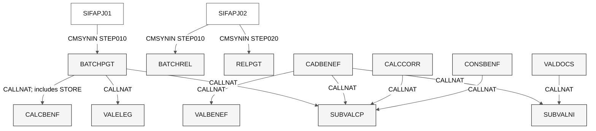

# Dependency map - SIFAP legacy

> **Trail:** [Team kit](../README.md) > [Stage 1](README.md) > **Dependencies**

**Static edges found in all 24 library files, separated by mechanism and side effect.**

| Field | Value |
|---|---|
| Date / team | 2026-09-10 / [To be filled by the team] |
| Corpus | 12 NSP, 5 NSN, 2 NSC, 2 NSA, 1 NSL, 2 JCL |
| Source edges | 9 CALLNAT + 9 INCLUDE + 23 USING = 41 |
| JCL invocation edges | 3, separate from the 41 source edges |
| Verification boundary | Source inspection, not compiled or runtime-observed call coverage |

Comments, disabled code and declarations alone do not establish executable
calls or database operations. Internal `PERFORM` routines are documented in
the [rule catalogue](business-rules-catalog.md), not counted as CALLNAT edges.

## Calls and job entry points

This diagram deliberately excludes data-area imports and database access;
the tables below cover those mechanisms. It does not assert scheduling between
J01 and J02: that dependency appears only in JCL comments in this corpus.

| Caller | Callee | Call-site evidence |
|---|---|---|
| BATCHPGT | SUBVALCP | [BATCHPGT.NSP](legacy-sifap/natural-programs/BATCHPGT.NSP#L276), 276-278 |
| BATCHPGT | VALELEG | [BATCHPGT.NSP](legacy-sifap/natural-programs/BATCHPGT.NSP#L369), 369-375 |
| BATCHPGT | CALCBENF | [BATCHPGT.NSP](legacy-sifap/natural-programs/BATCHPGT.NSP#L381), 381-387 |
| CADBENEF | SUBVALCP | [CADBENEF.NSP](legacy-sifap/natural-programs/CADBENEF.NSP#L161), 161-163 |
| CADBENEF | SUBVALNI | [CADBENEF.NSP](legacy-sifap/natural-programs/CADBENEF.NSP#L196), 196-198 |
| CADBENEF | VALBENEF | [CADBENEF.NSP](legacy-sifap/natural-programs/CADBENEF.NSP#L263), 263-265 |
| CALCCORR | SUBVALCP | [CALCCORR.NSP](legacy-sifap/natural-programs/CALCCORR.NSP#L160), 160-162 |
| CONSBENF | SUBVALCP | [CONSBENF.NSP](legacy-sifap/natural-programs/CONSBENF.NSP#L136), 136-138 |
| VALDOCS | SUBVALNI | [VALDOCS.NSP](legacy-sifap/natural-programs/VALDOCS.NSP#L109), 109-111 |

SUBVALCP has four source callers; SUBVALNI has two. No active `CALLNAT CALCDSCT`,
`CALLNAT CALCCORR` or `FETCH` occurs in these files. This is not proof that
interactive members are unused in a wider deployment.

## Copycode edges

`INCLUDE` inserts code at compilation; it is not a separate runtime call.

| Including member | Copycode | Evidence |
|---|---|---|
| BATCHCON | CCAUDIT | [BATCHCON.NSP](legacy-sifap/natural-programs/BATCHCON.NSP#L345) |
| BATCHPGT | CCAUDIT | [BATCHPGT.NSP](legacy-sifap/natural-programs/BATCHPGT.NSP#L594) |
| CADBENEF | CCAUDIT | [CADBENEF.NSP](legacy-sifap/natural-programs/CADBENEF.NSP#L418) |
| CADDEPEN | CCAUDIT | [CADDEPEN.NSP](legacy-sifap/natural-programs/CADDEPEN.NSP#L235) |
| CADPROG | CCAUDIT | [CADPROG.NSP](legacy-sifap/natural-programs/CADPROG.NSP#L176) |
| CALCCORR | CCAUDIT | [CALCCORR.NSP](legacy-sifap/natural-programs/CALCCORR.NSP#L243) |
| CONSBENF | CCAUDIT | [CONSBENF.NSP](legacy-sifap/natural-programs/CONSBENF.NSP#L314) |
| CADDEPEN | CCVALCPF | [CADDEPEN.NSP](legacy-sifap/natural-programs/CADDEPEN.NSP#L230) |
| SUBVALCP | CCVALCPF | [SUBVALCP.NSN](legacy-sifap/natural-programs/SUBVALCP.NSN#L94) |

Each of the seven audit includers actually invokes `PERFORM WRITE-AUDIT` in
its body. That subroutine reads the audit seed and stores a record at
[CCAUDIT.NSC](legacy-sifap/natural-programs/CCAUDIT.NSC#L60), 60-100.
Neither copycode owns a transaction or has its own `ON ERROR` block.

## Data-area edges

Grouped rows enumerate all 23 imports. `LOCAL USING` is a local data-area
instance; it must not be described as shared global mutable state.

| Member | LOCAL USING | PARAMETER USING | Evidence |
|---|---|---|---|
| BATCHCON | LDASIFAP | - | [BATCHCON.NSP](legacy-sifap/natural-programs/BATCHCON.NSP#L21) |
| BATCHPGT | PDAVALID, PDACALC, LDASIFAP | - | [BATCHPGT.NSP](legacy-sifap/natural-programs/BATCHPGT.NSP#L28), 28-30 |
| BATCHREL | LDASIFAP | - | [BATCHREL.NSP](legacy-sifap/natural-programs/BATCHREL.NSP#L23) |
| CADBENEF | PDAVALID | - | [CADBENEF.NSP](legacy-sifap/natural-programs/CADBENEF.NSP#L14) |
| CADDEPEN | LDASIFAP | - | [CADDEPEN.NSP](legacy-sifap/natural-programs/CADDEPEN.NSP#L13) |
| CADPROG | LDASIFAP | - | [CADPROG.NSP](legacy-sifap/natural-programs/CADPROG.NSP#L13) |
| CALCBENF | LDASIFAP | PDACALC | [CALCBENF.NSN](legacy-sifap/natural-programs/CALCBENF.NSN#L17), 17-18 |
| CALCCORR | PDAVALID, LDASIFAP | - | [CALCCORR.NSP](legacy-sifap/natural-programs/CALCCORR.NSP#L13), 13-14 |
| CALCDSCT | LDASIFAP | - | [CALCDSCT.NSP](legacy-sifap/natural-programs/CALCDSCT.NSP#L13) |
| CONSBENF | PDAVALID, LDASIFAP | - | [CONSBENF.NSP](legacy-sifap/natural-programs/CONSBENF.NSP#L19), 19-20 |
| RELAUDIT | LDASIFAP | - | [RELAUDIT.NSP](legacy-sifap/natural-programs/RELAUDIT.NSP#L19) |
| RELPGT | LDASIFAP | - | [RELPGT.NSP](legacy-sifap/natural-programs/RELPGT.NSP#L18) |
| SUBVALCP | - | PDAVALID | [SUBVALCP.NSN](legacy-sifap/natural-programs/SUBVALCP.NSN#L29) |
| SUBVALNI | - | PDAVALID | [SUBVALNI.NSN](legacy-sifap/natural-programs/SUBVALNI.NSN#L39) |
| VALBENEF | LDASIFAP | Explicit 10-field interface, not a PDA import | [VALBENEF.NSN](legacy-sifap/natural-programs/VALBENEF.NSN#L15), 15-27 |
| VALDOCS | PDAVALID | - | [VALDOCS.NSP](legacy-sifap/natural-programs/VALDOCS.NSP#L15) |
| VALELEG | LDASIFAP | PDACALC | [VALELEG.NSN](legacy-sifap/natural-programs/VALELEG.NSN#L16), 16-17 |

LDASIFAP has 13 importers, PDAVALID 7, PDACALC 3. The declaration-only
members do not introduce executable calls. Positional interfaces contain
6 fields in PDAVALID and 16 in PDACALC; the CALLNAT lists match their declared
order in the supplied source. Exact runtime type/size compatibility remains a
compiler-validation task, particularly at numeric/alpha and array boundaries.

## Direct DDM access

Bindings and all fields are in the [data map](data-map.md). Multiple operations
on the same view are grouped below; source references identify the actual statements.
Audit access through included code is recorded separately above, not invented
as a direct statement in each caller.

| Member | DDM | Operations | Evidence |
|---|---|---|---|
| BATCHPGT | BENEFIC | READ by CPF | [BATCHPGT.NSP](legacy-sifap/natural-programs/BATCHPGT.NSP#L250) |
| BATCHPGT | SOCPROG | FIND by program | [BATCHPGT.NSP](legacy-sifap/natural-programs/BATCHPGT.NSP#L302) |
| BATCHPGT | PAYMENT | READ greatest number; FIND NUMBER by S1; STORE | [seed](legacy-sifap/natural-programs/BATCHPGT.NSP#L240); [check](legacy-sifap/natural-programs/BATCHPGT.NSP#L294); [write](legacy-sifap/natural-programs/BATCHPGT.NSP#L488) |
| BATCHREL | PAYMENT | READ by period | [BATCHREL.NSP](legacy-sifap/natural-programs/BATCHREL.NSP#L125) |
| BATCHREL | BENEFIC | FIND by CPF | [BATCHREL.NSP](legacy-sifap/natural-programs/BATCHREL.NSP#L142) |
| BATCHCON | PAYMENT | FIND by payment number; UPDATE for 00/01/02 | [lookup](legacy-sifap/natural-programs/BATCHCON.NSP#L171); [updates](legacy-sifap/natural-programs/BATCHCON.NSP#L206), 206-227 |
| BATCHCON | AUDIT | READ greatest number; two direct STORE helpers | [seed](legacy-sifap/natural-programs/BATCHCON.NSP#L116); [helpers](legacy-sifap/natural-programs/BATCHCON.NSP#L311), 311-343 |
| CADBENEF | BENEFIC | FIND by CPF; STORE; UPDATE | [lookup](legacy-sifap/natural-programs/CADBENEF.NSP#L206); [writes](legacy-sifap/natural-programs/CADBENEF.NSP#L295), 295-328 |
| CADDEPEN | BENEFIC | FIND holder; inspect/append PE; UPDATE | [holder](legacy-sifap/natural-programs/CADDEPEN.NSP#L96); [duplicate](legacy-sifap/natural-programs/CADDEPEN.NSP#L175); [write](legacy-sifap/natural-programs/CADDEPEN.NSP#L191), 191-211 |
| CADPROG | SOCPROG | FIND; STORE; query FIND | [lookup](legacy-sifap/natural-programs/CADPROG.NSP#L111); [store](legacy-sifap/natural-programs/CADPROG.NSP#L139); [query](legacy-sifap/natural-programs/CADPROG.NSP#L158) |
| CALCBENF | BENEFIC | FIND by CPF | [CALCBENF.NSN](legacy-sifap/natural-programs/CALCBENF.NSN#L166) |
| CALCBENF | SOCPROG | FIND by program | [CALCBENF.NSN](legacy-sifap/natural-programs/CALCBENF.NSN#L188) |
| CALCBENF | PAYMENT | STORE and commit | [CALCBENF.NSN](legacy-sifap/natural-programs/CALCBENF.NSN#L319), 319-320 |
| CALCCORR | PAYMENT | READ by CPF; UPDATE correction | [read](legacy-sifap/natural-programs/CALCCORR.NSP#L174); [update](legacy-sifap/natural-programs/CALCCORR.NSP#L208) |
| CALCDSCT | PAYMENT | FIND at selection, PE processing and update; UPDATE deduction total | [selection](legacy-sifap/natural-programs/CALCDSCT.NSP#L79); [PE](legacy-sifap/natural-programs/CALCDSCT.NSP#L113); [update](legacy-sifap/natural-programs/CALCDSCT.NSP#L184), 184-188 |
| CALCDSCT | BENEFIC | FIND by CPF | [CALCDSCT.NSP](legacy-sifap/natural-programs/CALCDSCT.NSP#L93) |
| VALELEG | BENEFIC | FIND by CPF | [VALELEG.NSN](legacy-sifap/natural-programs/VALELEG.NSN#L84) |
| VALELEG | SOCPROG | FIND by program | [VALELEG.NSN](legacy-sifap/natural-programs/VALELEG.NSN#L100) |
| CONSBENF | BENEFIC | FIND by CPF or NIS | [CONSBENF.NSP](legacy-sifap/natural-programs/CONSBENF.NSP#L149), 149-163 |
| CONSBENF | PAYMENT | READ by CPF | [CONSBENF.NSP](legacy-sifap/natural-programs/CONSBENF.NSP#L271) |
| RELPGT | PAYMENT | READ by period interval | [RELPGT.NSP](legacy-sifap/natural-programs/RELPGT.NSP#L123), 123-124 |
| RELPGT | BENEFIC | FIND by CPF | [RELPGT.NSP](legacy-sifap/natural-programs/RELPGT.NSP#L154) |
| RELAUDIT | AUDIT | READ date interval; HISTOGRAM date interval | [read](legacy-sifap/natural-programs/RELAUDIT.NSP#L111); [histogram](legacy-sifap/natural-programs/RELAUDIT.NSP#L260) |
| CCAUDIT | AUDIT through caller view | READ greatest number; STORE | [seed](legacy-sifap/natural-programs/CCAUDIT.NSC#L66); [store](legacy-sifap/natural-programs/CCAUDIT.NSC#L98) |

VALBENEF and VALDOCS declare BENEFIC views but issue no DDM operation.
SUBVALCP, SUBVALNI and CCVALCPF have no database access. No executable DELETE
was found. The read-only shared lab viewer is external and is not CONSBENF:
CONSBENF invokes a stored audit through CCAUDIT.

## Work files and JCL

| Origin | Destination / input | Evidence and boundary |
|---|---|---|
| SIFAPJ01 STEP010 | BATCHPGT, period 202601 | [SIFAPJ01.jcl](legacy-sifap/natural-programs/SIFAPJ01.jcl#L69), 69-74 |
| BATCHPGT | Work 1: extract A240; work 2: rejection A120 | [writes](legacy-sifap/natural-programs/BATCHPGT.NSP#L284), 284, 309; [extract](legacy-sifap/natural-programs/BATCHPGT.NSP#L491), 491-502; [DDs](legacy-sifap/natural-programs/SIFAPJ01.jcl#L53), 53-63 |
| SIFAPJ01 STEP020 | Copy extract to transmission area when prior normal RC <=4 | [SIFAPJ01.jcl](legacy-sifap/natural-programs/SIFAPJ01.jcl#L80), 80-87 |
| SIFAPJ02 STEP010 | BATCHREL, period 202601 | [SIFAPJ02.jcl](legacy-sifap/natural-programs/SIFAPJ02.jcl#L66), 66-71 |
| BATCHREL | Printer 1, archival work 1 A132 | [BATCHREL.NSP](legacy-sifap/natural-programs/BATCHREL.NSP#L208), 208-250; [DDs](legacy-sifap/natural-programs/SIFAPJ02.jcl#L56), 56-64 |
| SIFAPJ02 STEP020 | RELPGT, 202601..202601, all programs | [SIFAPJ02.jcl](legacy-sifap/natural-programs/SIFAPJ02.jcl#L77), 77-101 |
| BATCHCON | Read work 1, bank-return A240 | [BATCHCON.NSP](legacy-sifap/natural-programs/BATCHCON.NSP#L120), 120-166; no supplied JCL invokes it |
| RELAUDIT | Screen or printer 1 on demand | [RELAUDIT.NSP](legacy-sifap/natural-programs/RELAUDIT.NSP#L195), 195-210; no supplied JCL invokes it |

The generated payroll extract and the incoming bank-return record are distinct
interfaces; equal record lengths do not prove identical layouts. The supplied
JCLs do not contain bank transfer tooling, live scheduler definitions or a SIAFI
client. SIAFI fields in a DDM are not an executable integration edge.

## Transaction boundaries to review

| Path | Source order | Evidence |
|---|---|---|
| Registrations | Data mutation, audit helper, commit | [CADBENEF](legacy-sifap/natural-programs/CADBENEF.NSP#L295), 295-326; [CADDEPEN](legacy-sifap/natural-programs/CADDEPEN.NSP#L203), 203-211; [CADPROG](legacy-sifap/natural-programs/CADPROG.NSP#L139), 139-147 |
| Payment generation | CALCBENF stores/commits; caller later stores/commits and writes work file | [callee](legacy-sifap/natural-programs/CALCBENF.NSN#L319), 319-320; [caller](legacy-sifap/natural-programs/BATCHPGT.NSP#L381), 381-502 |
| Corrections | Update/commit before audit, without explicit final audit commit | [CALCCORR](legacy-sifap/natural-programs/CALCCORR.NSP#L204), 204-226 |
| Reconciliation | Payment updates and direct audit helpers commit separately | [BATCHCON](legacy-sifap/natural-programs/BATCHCON.NSP#L204), 204-235, 311-343 |
| Deductions | Update/commit deduction total without audit or net recomputation | [CALCDSCT](legacy-sifap/natural-programs/CALCDSCT.NSP#L184), 184-188 |
| Consultation | Audit helper and commit after successful display | [CONSBENF](legacy-sifap/natural-programs/CONSBENF.NSP#L168), 168-179 |

These are ordering observations. Restart guarantees, lock behavior, concurrent
sequence generation and error recovery remain open in the
[question register](mysteries-found.md).

## Completion checks

- [x] All 41 source dependency statements and 3 JCL invocation sites are represented.
- [x] Include/import/runtime-call mechanisms are separated.
- [x] Declared-only views are not counted as database reads.
- [x] Each direct database edge has a source reference.
- [ ] Validate compilation, runtime call contracts and error paths in an authorized environment.

### Continue reading

| Previous | Next |
|---|---|
| [Business rule candidates](business-rules-catalog.md) | [Open questions](mysteries-found.md) |
